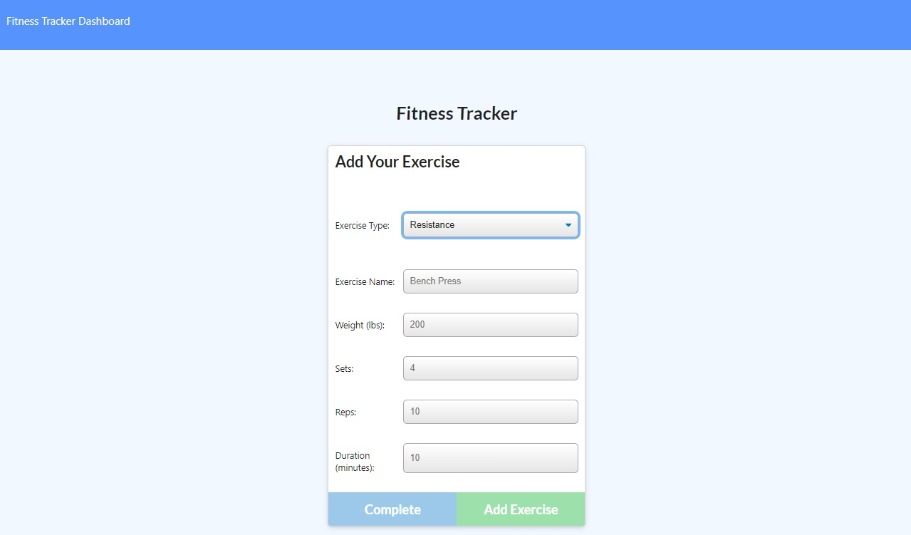

# Workout-Tracker

# Description
A workout tracker to view create and track daily workouts.

# Deployed site:
 [Click Here](https://fierce-oasis-20963.herokuapp.com/)
# Table of Contents
* [Installation](#installation)
* [Usage](#usage)
* [License](#license)
* [Contributing](#contributing)
* [Tests](#tests)
* [Questions](#questions)
# Installation
Run npm i for all dependencies, connect mongoDB variables
# Usage
Free use.
# License
This work is covered under the CC0 1.0 Universal license.
Full license information can be found here: [License: CC0-1.0](http://creativecommons.org/publicdomain/zero/1.0/)

# Contributing
N/A
# Tests
N/A
# Questions
Email
# Screenshots

